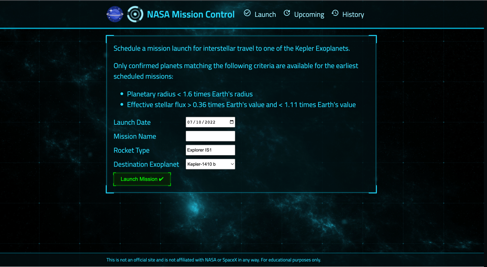

# Node.js SpaceX API Mission Tracker

I connected the SpaceX API with a NASA mission control front-end to show
all launches filtering the information to show which missions have been
completed or aborted. All the data is saved on a MongoDB database. The
user can also create & abort future missions to the Exoplanets from NASA’s
data

## Techs used: 
- Node
- Express
- Axios
- MongoDB
- React

Thank you for reading!

/////////////////////////////////////////////////
## Available Scripts

In the project directory, you can run:

### `npm run server` 
runs server on http://localhost:3000

### `npm run deploy`
runs front end and back end and checks for any changes in the client folder, copies public folder into back end

### `npm run test`
to run supertest

### `npm run deploy-cluster`
to run test and deploy app